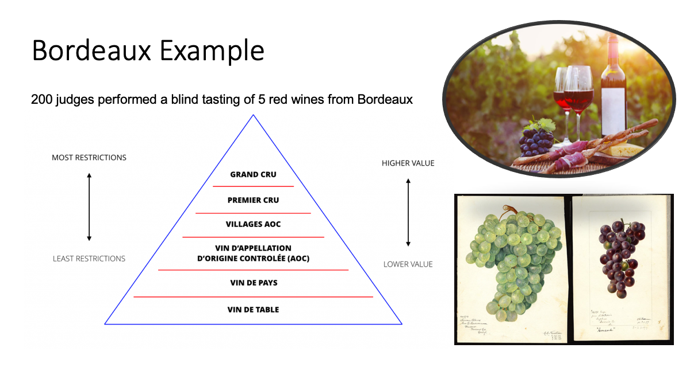
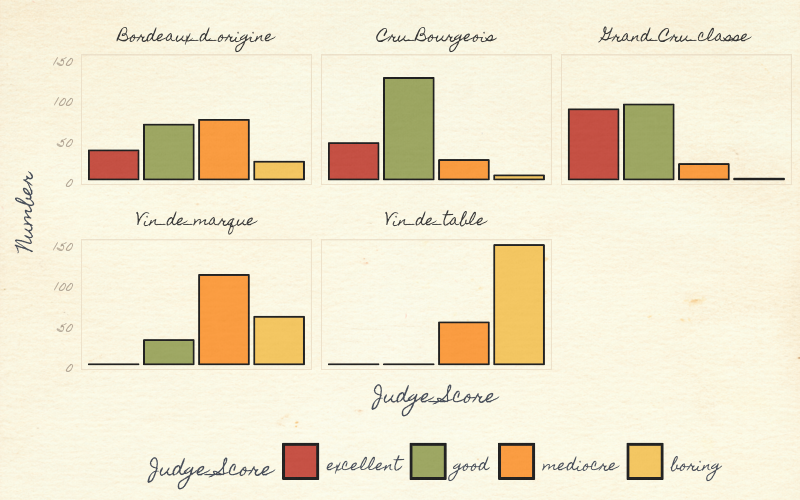
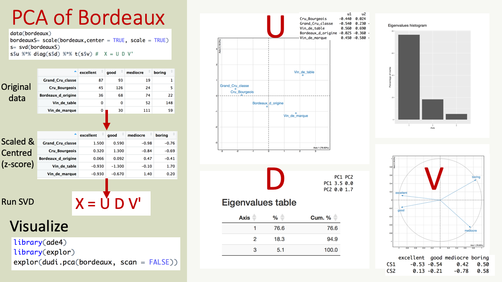
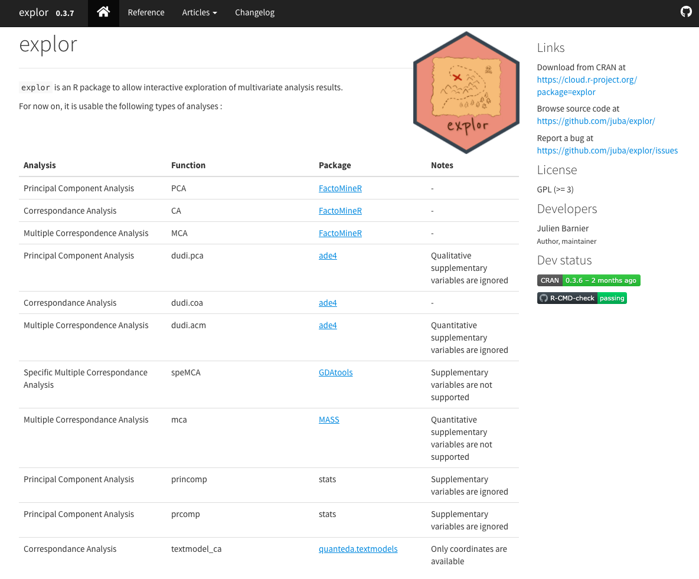

```{r setup, echo=FALSE, message=FALSE, warning=FALSE, class.source = 'fold-show'}
library(knitr)
# Set up the environment
opts_chunk$set(echo=TRUE, dpi=100, warnings=FALSE, message=FALSE, warning=FALSE, fig.width = 10, fig.height = 6) 
```

### R libraries
Install, if necessary, and load necessary libraries and set up R session. If you are running the docker container or using an instance on the orchestra platform, then you should have these libraries installed already. 

```{r libraries}
#if (!requireNamespace("BiocManager", quietly = TRUE)) #install.packages("BiocManager")
library(dplyr)
library(ggplot2)
library(explor)
library(ade4)
library(tibble)
library(reshape2)
```

# Introduction

Principal component analysis (PCA) provides a method for visualizing the distinguishing patterns or information in a dataset.  Additional tutorials will provide a more in-depth review of the method, this is just a short and sweet "taster" vignette. 


#  Dataset: Winetasting in Bordeaux
We will use a very simple example dataset of wine-tasting where 200 judges performed a blind tasting of 5 red wines from Bordeaux, scoring each as boring, mediocre, good or excellent. 

The dataset is available in the `ade4` R package:

```{r}
data(bordeaux)
```

In French wines, table wine has fewer legal restrictions and is cheaper, whereas Cru and Grand Cru wine have more regulation standards and therefore are more expensive.


```{r bordeaux, echo=FALSE, fig.cap="Figure 1: The bordeaux dataset provides scores from 200 judges in a blind tasting of five different types of red wine from the Bordeaux region of south western parts of France. The judges scored wines as excellent, good, mediocre and boring.", out.width = '100%'}

```


```{r}
data(bordeaux)
bordeaux
```


Data visualization is important and always a good first step with any dataset, even simple ones. We visualize this data, with a simple barplot, to see the distribution of excellent, good, mediocre and boring scores for each wine. The Grand Cru Classe received more "excellent" scores than the Vin_de_table (table wine). 


```{r, eval=FALSE}
#devtools::install_github("gadenbuie/ggpomological")
#install.packages("magick")

df<-bordeaux %>%
  tibble::rownames_to_column(var="Wine") %>%
  reshape2::melt(.,variable.name="Judge_Score",
                 value.name="Number")

p<- ggplot(df,
           aes(Judge_Score, Number, fill=Judge_Score))+
    geom_bar(color="black",stat = "identity") +
    facet_wrap(~Wine, nrow = 2)+
    scale_fill_pomological()+
    theme_pomological("Homemade Apple", 12)+
    theme(axis.text.x=element_blank(),
          legend.position = "bottom",
          legend.key = element_rect(colour = "black"))

 paint_pomological(p,res = 110) %>%
   magick::image_write("barplot-painted.png")
```

```{r pomological, echo=FALSE, fig.cap="Figure: Visualizing the bordeaux dataset using ggplot and ggtheme pomological", out.width = '100%'}

```

To make it visually interesting we used the  `ggpomological` graphics ggtheme, to display these wine data. The pomology ggtheme and palette evokes the style and colors of old watercolor prints of pomology; a branch of botany that studies and cultivates fruit   [ggpomological](https://www.garrickadenbuie.com/project/ggpomological).
 
# Running PCA 

We will show two quick approaches to run PCA as seen in Figure 3.


## 1.  SVD of scaled and centered data

We will scale the data with `center=TRUE, scale=TRUE`, 


```{r}
X= scale(bordeaux,center = TRUE, scale = TRUE)
head(X)
```

and apply singular value decomposition (SVD) to the z-score scaled data, X. The SVD was discovered over 100 years ago independently by Eugenio Beltrami (1835–1899) and Camille Jordan (1838–1921).  Martin and Porter (2012) wrote a very readable and enjoyable article on the history and application of SVD entitled ['The Extraordinary SVD'](https://people.maths.ox.ac.uk/porterm/papers/s4.pdf).

SVD matrix decomposition of X will generates 3 matrices, U, D, V where $$X = U D V'$$

```{r}
s= svd(X)
str(s)
```

```{r}
s$u %*% diag(s$d) %*% t(s$v) #  X = U D V'
```


```{}
D - singular values.
U - the left singular vectors 
V - the right singular vectors 
```

The rank of X is equal to the number of non-zero singular values, the length(D), is equal to the columns of matrices U,V. The max rank is the number of rows or columns of X, whichever is lower. In this 5x4 dimension matrix, the max rank is 4.

```{r}
min(dim(X))
```

```{r}
identical(length(s$d), min(dim(X)))
identical(ncol(s$u), ncol(s$v), length(D))
```

In statistics and machine learning we talk about finding a low-rank approximation of a matrix, that is a few vectors that approximate the matrix, which can be done by subsetting to a few eigenvectors, or setting eigenvalues to zero.

Finally, the left (U) and right (V) singular vectors  $$ U D V'$$ provide a new subspace for the rows and columns of X, respectively. 

```{r}
identical(nrow(s$u), nrow(X))
identical(nrow(s$v), ncol(X))
```


### Eigenvalues

The diagonal matrix $$diag(s$d)$$ contain the singular values, which are always $$>0$$.

```{r}
diag(s$d)
```

The singular values `s$d` are square roots of eigenvalues.  The eigenvalues which tell how much variance is captured by each component. The maximum number of eigenvalues is the min of the number of row or columns in X.

```{r}
round(((s$d^2 /sum(s$d^2 ))*100),2)
```


The first component (PC1, horizontal) captured almost 76.6% of the variance or information in the data and the second component has 18.3%, cumulatively, a plot of PC1 and PC2 would include 95% of the variance in the data.  Therefore by droping PC3 and PC4, we have a lower rank representation of X.

### Eigenvector

Eigenvalues and eigenvectors come in pairs. The columns in U and V are the eigenvectors associated with the singular values in D. The rank is 4, we have four eigenvectors and eigenvalues.  

Eigenvalues are ranked, such that the first component PC1 explains the most variance, the second explains the next and so forth.  The vectors are orthogonal, uncorrelated.  Each tells a different aspect about the data. 

So lets look at the singular vectors. The first component, vector PC1 captures almost 77% of the data, but what signal is captures by PC1. Lets look at the first column in the matrices U and V.

The matrix U has the same number rows, representing the 5 wines as the matrix X.  

```{r}
data.frame(rownames(bordeaux), s$u)
```

The number of rows of matrix V equals the number of columns in matrix X; the judges scores (boring/medicore/ood/excellent)

```{r}
data.frame(colnames(bordeaux), s$v)
```

We will cover more about intepreting PC1, and these scores in the next vignette. But we see PC1 distinguished Boring/medicore from Good/excellent wines.

- ** positive values ** of PC1 
    - Boring/medicore judge scores (PC1, right singular vector)
    - Vin de table (Table Wine) and Vin de marque (Brand Wine)  (PC1, left singular vector)

-  ** negative values ** of PC1 
  - Good/excellent scores of the first left singular vectors. 
  - Cru and Grand Cru wines have have negative values on first right singular vectors. Regional Bordeaux wine (Bordeaux d'origine) is close to the origin.  
  

If a left singular vector has its sign changed, changing the sign of the corresponding right vector gives an equivalent decomposition. Therefore we look at the direction and distance from the origin, aka the separation either side of the origin. 

## Scores

```{r}
pc.scores <- s$u %*% diag(s$d)
colnames(pc.scores) <- paste0("PC", 1:ncol(pc.scores))
data.frame(rownames(bordeaux),pc.scores)
```


### Special properties of svd
Recall SVD decomposes X to:

$$M = U D V^{t}$$

where U,V define the left and right singular values 

Note that matrices U and V are square orthogonal, that means

$$UU^{t} = I_{p}$$
$$VV^{t} = I_{n}$$


## 2. Using a PCA function in R

We can perform the same calculation by as calling a PCA function, for example if we call the R function prcomp

```{r}
prcomp(bordeaux, scale=TRUE, center=TRUE)
```

The pc.scores manually calculated above is the same as

```{r}
prcomp(bordeaux, center = TRUE, scale=TRUE)$x
```


Or we can use the ade4 function dudi.pca. By default dudi.pca uses center = TRUE, scale = TRUE
```{r}
bordeaux.pca<-dudi.pca(bordeaux, scan = FALSE)
summary(bordeaux.pca)
```

If we plot the output of bordeaux.pca, we see the first component (horizontal), captures most of the information in the dataset, distinguished Vin de table and Vin de marque from the other wines. Whilst  Vin de table and Vin de marque were associated with the scores "boring" and "mediocre".  The Grand Cru and Cru wines were "excellent" and "good"


```{r}
scatter( bordeaux.pca)
```

We will learn more about the relationship between SVD and PCA, the different R packages that run PCA, in the second vignette Principal Component Analysis in R. We will apply PCA to genomics data in the 4th vignette of the workshop;  PCA example: scRNAseq. 


```{r pca, echo=FALSE, fig.cap="Figure 3: Overview of a PCA of bordeaux dataset", out.width = '100%'}

```
# A few resources for visualization of Results; Explor, pcaExplorer 

## Explor
Julien Barnier's package `explor` provides a nice shiny interface to explore matrix factorization results including PCA, Correspondence analysis, or Multiple correspondence analysis and other dimension reduction methods available in R packages `ade4`, `vegan`, `FactoMineR`, `GDATools`, `MASS`, `stats` (`prcomp` or `princomp`)

```{r explor, echo=FALSE, fig.cap="Explor", out.width = '70%'}

```


## pcaExplorer
Federico Marini and Harald Binder have create a Bioconductor package called `pcaExplorer`

```{r pcaExplorer, echo=FALSE, fig.cap="PCA of bordeaux dataset", out.width = '70%'}
knitr::include_graphics("./image/pcaExplor.png")
```


```{r}
sessionInfo()
```


